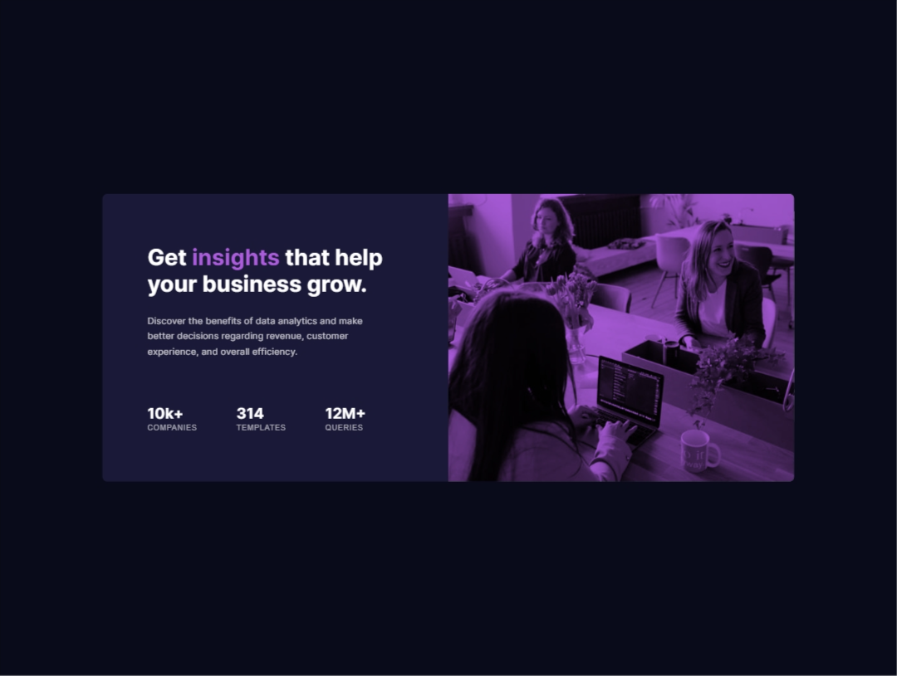

# Frontend Mentor - Stats preview card component solution

This is a solution to the [Stats preview card component challenge on Frontend Mentor](https://www.frontendmentor.io/challenges/stats-preview-card-component-8JqbgoU62). Frontend Mentor challenges help you improve your coding skills by building realistic projects. 

## Table of contents

- [Overview](#overview)
  - [The challenge](#the-challenge)
  - [Screenshot](#screenshot)
  - [Links](#links)
- [My process](#my-process)
  - [Built with](#built-with)
  - [What I learned](#what-i-learned)
  - [Continued development](#continued-development)
  - [Useful resources](#useful-resources)
- [Author](#author)

## Overview

### The challenge

Users should be able to:

- View the optimal layout depending on their device's screen size
- See hover effects for interactive elements
- Experience proper color overlay effects on the hero image

### Screenshot




### Links

- Solution URL: (https://www.frontendmentor.io/solutions/stats-preview-card-component-with-html-css-and-js-EHPZ-_5TFm)
- Live Site URL:(https://mfrekee.github.io/stats-preview-card-component-main/)

## My process

### Built with

- Semantic HTML5 markup
- CSS custom properties
- Flexbox
- CSS Grid
- Mobile-first workflow
- Responsive images with separate desktop/mobile assets
- CSS blend modes for image overlay effects

### What I learned

This project helped me understand several key concepts in responsive web design:

**1. Responsive Image Handling:**
I learned how to implement different images for different screen sizes using CSS display properties:

```css
.desktop-image {
  display: block;
}

.mobile-image {
  display: none;
}

@media (max-width: 768px) {
  .desktop-image {
    display: none;
  }
  
  .mobile-image {
    display: block;
  }
}
```

**2. CSS Blend Modes for Image Overlays:**
Creating the purple overlay effect on images using CSS blend modes and pseudo-elements:

```css
.image-container::before {
  content: '';
  position: absolute;
  top: 0;
  left: 0;
  right: 0;
  bottom: 0;
  background-color: hsl(277, 64%, 61%);
  mix-blend-mode: multiply;
  z-index: 2;
}
```

**3. CSS Grid Layout Transformation:**
Understanding how to change grid layouts completely between desktop and mobile:

```css
.card {
  display: grid;
  grid-template-columns: 1fr 1fr; /* Desktop: side by side */
}

@media (max-width: 768px) {
  .card {
    grid-template-columns: 1fr; /* Mobile: single column */
    grid-template-rows: auto 1fr;
  }
}
```

### Continued development

In future projects, I want to focus on:

- **Advanced CSS Grid techniques** - Exploring more complex grid layouts and responsive patterns
- **Accessibility improvements** - Better screen reader support and keyboard navigation
- **Performance optimization** - Implementing lazy loading for images and optimizing asset delivery
- **CSS animations** - Adding subtle hover effects and micro-interactions to enhance user experience

### Useful resources

- [MDN CSS Grid Guide](https://developer.mozilla.org/en-US/docs/Web/CSS/CSS_Grid_Layout) - This helped me understand grid layout fundamentals and responsive grid patterns.
- [CSS-Tricks Flexbox Guide](https://css-tricks.com/snippets/css/a-guide-to-flexbox/) - An excellent resource for mastering flexbox properties and alignment techniques.
- [MDN mix-blend-mode](https://developer.mozilla.org/en-US/docs/Web/CSS/mix-blend-mode) - Essential for understanding how to create image overlay effects with blend modes.

## Author

- Frontend Mentor - [@Mfrekee](https://www.frontendmentor.io/profile/Mfrekee)
- Twitter - [@acmfrekemfon](https://www.x.com/acmfrekemfon)